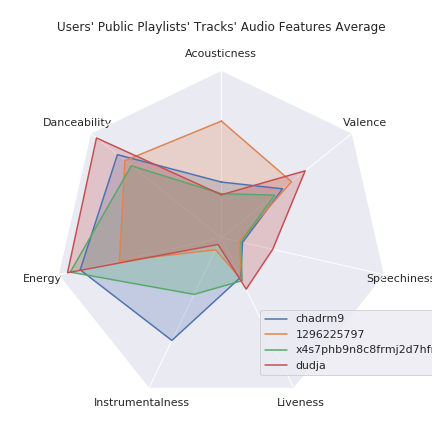
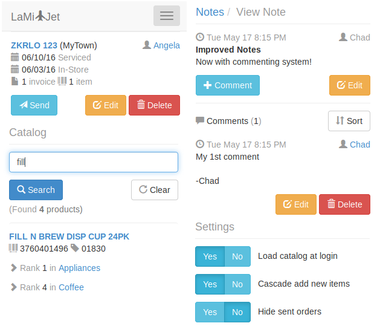

## Welcome!

So here we are, fresh jekyll site, updated gems, and a fresh CV for any potential employers that I refer to this page.

### Polka

Recently I broke ground on an ongoing project I call [Polka](https://github.com/chadrm9/polka). Polka can retreive and store Spotify user
data (e.g. track audio features) as NumPy matricies for use with [SciPy](https://scipy.org), [Scikit-learn](https://scikit-learn.org) and
[Project Jupyter](https://jupyter.org).

Read more [here](https://github.com/chadrm9/polka)

### LaMi✈Jet

I built an end-to-end inventory management system on a MEAN stack (i.e. MongoDB, Express.js, AngularJS and Node.js)
to provide employees with mobile-web or offline-sync access to product search, stock and reorder functionality.

This [project](https://github.com/chadrm9/lami-jet) was extended from an
[Angular Full-Stack Generator](https://github.com/DaftMonk/generator-angular-fullstack) v3.5.0 scaffolding to suit design requirements.

Contact [me](mailto:{{ site.email }}) for credentials and login to the demo [here](https://lamijet.herokuapp.com).
